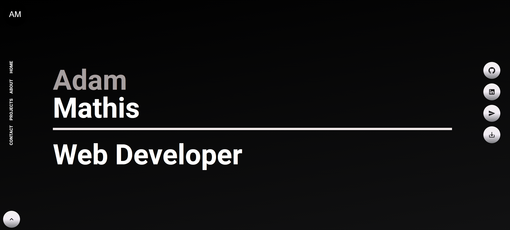
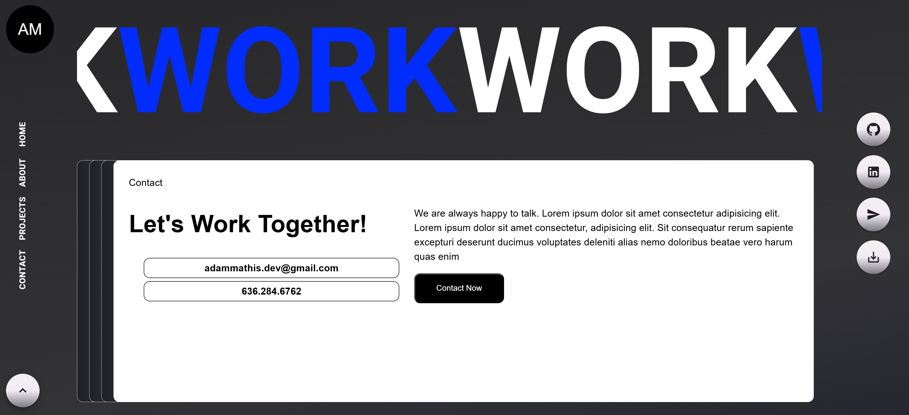
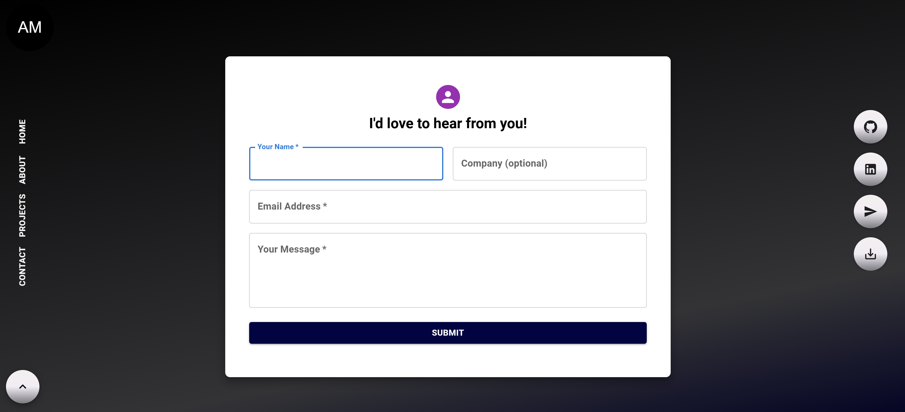

# Adam's Web Developer Portfolio 
  

          
  
  ## Description  ✏️
  
  This project was coded for a student who wanted a modern, animated portfolio to showcase his work.
  
  ## Table of Contents 📖
  
  [Installation](#installation)

  [Usage](#usage)

  

  [Issues](#known-issues)


  [Credits](#credits)

  [Questions](#questions)
  
  ## Installation 
  
  To install necessary dependencies, run the following command:
  
  ```
  npm i
  ```
  
  ## Usage 
  
  Clone the repository, run the install command and then 'npm start'. Then navigate to the localhost port.

  ### Deployed Link
  https://adams-portfolio2.netlify.app/

### Screenshots







______________________________________________________________________________________


## Known Issues 
- The portfolio is not finished.
- Not fully responsive in mobile 
- CSS transitions are using left and right which does not take advantage of the GPU
- Project cards aren't done, especially more work needed in mobile view
- The look of the animated skills is bad


## Credits 
GSAP library for animations

 ## Questions 
  
 If you have any questions about the repo or notice any bugs you want to report, open an issue or contact me directly at megan.meyers.388@gmail.com. 
  
  